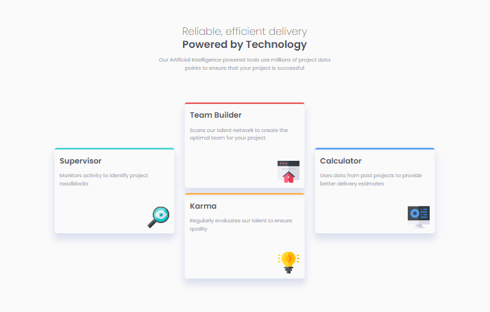

# Frontend Mentor - Four card feature section

Esta es una solución al [desafío del Four card feature section en Frontend Mentor](https://www.frontendmentor.io/challenges/interactive-rating-component-koxpeBUmI/hub). Los desafíos de Frontend Mentor lo ayudan a mejorar sus habilidades de codificación mediante la creación de proyectos realistas.

- Solution URL: [Github](https://github.com/ayrtonbolwal/fm-four-card-feature)
- Live Site URL: [Netifly](https://ayrtonbolwal-four-card-feature.netlify.app/)

## Mi Proceso

- Semántica de HTML5
- Variables en CSS
- Técnicas de Flexbox.
- Técnicas de Grid

## Cosas que aprendí

- Entrega de etapas con Git
- Uso de grid y flex combinados con querys

## Recursos recomendados

- [Conveción BEM](https://www.freecodecamp.org/espanol/news/convenciones-de-nomenclatura-de-css-que-te-ahorraran-horas-de-depuracion/)
- [Position absolute](https://developer.mozilla.org/en-US/docs/Web/CSS/position)
- [Flex](https://developer.mozilla.org/es/docs/Web/CSS/CSS_flexible_box_layout/Basic_concepts_of_flexbox)
- [Grid](https://developer.mozilla.org/es/docs/Web/CSS/grid)

Happy Coding! 👾🖖
Tráiganme a grid y flexbox 🔨⚡😎